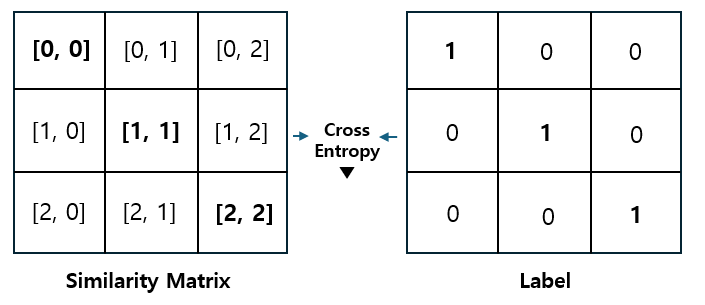

# 🍊 DPR(Dense Passage Retrieval)-KO

- **한국어 DPR(Dense Passage Retrieval) 모델**을 학습하는 코드입니다.
- 한국어 위키피디아 덤프를 이용해 모델의 검색 성능을 평가할 수 있습니다.
- [Facebook의 DPR 코드](https://github.com/facebookresearch/DPR)와는 다른 구성입니다. 몇 가지 문제점을 해결하기 위해 새롭게 코드를 작성했습니다.      

## 1. Dense Passage Retrieval

&nbsp; 

- DPR은 Facebook에서 공개한 **Dense Vector 기반 검색 모델**(또는 방법론)입니다.
- 질문을 인코딩하는 **Question Encoder**와 텍스트를 인코딩하는 **Context Encoder**로 이루어집니다.
               
&nbsp;&nbsp; 

- 상응하는 질문과 텍스트의 유사도는 키우고, 그렇지 않은 질문과 텍스트의 유사도는 낮추는 방식으로 학습합니다.
  - Batch Size가 3일 때, 두 인코더의 임베딩으로 (3 x 768) * (768 x 3) = (3 x 3)의 **Similarity Matrix**를 만들 수 있습니다. 이것의 **주대각선**이 서로 대응하는 질문과 텍스트의 유사도에 해당합니다.
  - Similarity Matrix와 **주대각선의 값이 1인 레이블**의 Cross Entropy를 줄여, 서로 대응하는 질문과 텍스트의 유사도가 1에 가까워지도록 합니다. 레이블의 다른 값은 0이므로, 서로 대응하지 않는 질문과 텍스트의 유사도는 0에 가까워집니다(in-batch negative).

- 이상의 방법으로 학습된 두 인코더를 이용해 **질문과 유사도가 가장 큰 텍스트**를 추출할 수 있습니다.               

## 2. DPR-KO
- **DPR-KO**는 위의 구조와 학습 방법론을 차용했으나 전혀 다른 코드로 이루어져 있습니다.
- 특히 다음과 같은 부분에서 Facebook이 공개한 기존의 DPR과 다릅니다. 

#### A. 인덱스 기반 검색 성능 평가
- 기존의 DPR은 검색한 텍스트가 **'정답(answer)'** 을 포함하고 있으면 올바른 텍스트를 추출한 것으로 간주합니다.

  - 질문 "2024년 올림픽이 열린 도시는?"에 대해 "파리"라는 단어가 있는 텍스트는 올바른 텍스트로 간주됩니다.
  - 이로 인해 **단답형 정답이 없는 데이터 셋**은 기존의 DPR 코드로 학습하기 어렵습니다.

```jsonc
# DPR-KO 학습/평가 데이터 예시

{'question': '바그너는 괴테의 파우스트를 읽고 무엇을 쓰고자 했는가?',
 'answers': ['교향곡'],
 'positive': [{'title': '파우스트_서곡',
   'text': '1839년 바그너는 괴테의 파우스트을 처음 읽고 그 내용에 마음이 끌려 이를 소재로 해서 하나의 교향곡을 쓰려는 뜻을 갖는다. 이 시기 바그너는 1838년에 빛 독촉으로 산전수전을 다 걲은 상황이라 좌절과 실망에 가득했으며 메피스토펠레스를 만나는 파우스트의 심경에 공감했다고 한다. 또한 파리에서 아브네크의 지휘로 파리 음악원 관현악단이 연주하는 베토벤의 교향곡 9번을 듣고 깊은 감명을 받았는데, 이것이 이듬해 1월에 파우스트의 서곡으로 쓰여진 이 작품에 조금이라도 영향을 끼쳤으리라는 것은 의심할 여지가 없다.',
   'idx': 0},
  {'title': '파우스트_서곡',
   'text': '또한 파리에서 아브네크의 지휘로 파리 음악원 관현악단이 연주하는 베토벤의 교향곡 9번을 듣고 깊은 감명을 받았는데, 이것이 이듬해 1월에 파우스트의 서곡으로 쓰여진 이 작품에 조금이라도 영향을 끼쳤으리라는 것은 의심할 여지가 없다. 여기의 라단조 조성의 경우에도 그의 전기에 적혀 있는 것처럼 단순한 정신적 피로나 실의가 반영된 것이 아니라 베토벤의 합창교향곡 조성의 영향을 받은 것을 볼 수 있다. 그렇게 교향곡 작곡을 1839년부터 40년에 걸쳐 파리에서 착수했으나 1악장을 쓴 뒤에 중단했다.',
   'idx': 1},
  {'title': '파우스트_서곡',
   'text': '그렇게 교향곡 작곡을 1839년부터 40년에 걸쳐 파리에서 착수했으나 1악장을 쓴 뒤에 중단했다. 또한 작품의 완성과 동시에 그는 이 서곡(1악장)을 파리 음악원의 연주회에서 연주할 파트보까지 준비하였으나, 실제로는 이루어지지는 않았다. 결국 초연은 4년 반이 지난 후에 드레스덴에서 연주되었고 재연도 이루어졌지만, 이후에 그대로 방치되고 말았다.',
   'idx': 2}],
 'answer_idx': [0, 1, 2]}
```

- 이 문제를 해결하기 위해 **Validation Set의 텍스트(gold passage)** 를 찾는 방식으로 평가 방법을 수정했습니다.
  - 위 예시에서처럼 질문에 대응하는 텍스트(positive_ctx)는 모두 **고유한 인덱스**를 갖습니다.
  - 평가시 질문의 정답 인덱스(answer_idx)에 포함된 인덱스를 지니는 텍스트만 정답으로 간주됩니다.
  - 학습 과정에서의 검색 성능 평가는 Validation Set의 질문과 텍스트만으로 이루어집니다.
  - 이상의 방법으로 정답이 없는 **'질문-텍스트'** 구성의 데이터 셋으로도 DPR 모델을 학습할 수 있습니다.

- 위키 피디아 덤프를 이용한 검색 성능 평가는 **'위키피디아 덤프 + Valiation Set'** 환경에서 이루어집니다.
  - 위키 피디아 덤프의 텍스트는 Validation Set의 마지막 인덱스보다 큰 수를 차례로 인덱스로 부여 받습니다.
  - 위키 피디아 덤프를 인코딩 하는 과정에서 Validation Set의 제목(title)과 일치하는 텍스트는 삭제됩니다.
  - **전체 코퍼스**에서 Validation Set의 질문에 대응하는 텍스트를 추출하는 방식으로 평가를 진행합니다.
  
#### B. Hard Negative 손실 계산
- 기존의 DPR 코드의 [손실함수](https://github.com/facebookresearch/DPR/blob/main/dpr/models/biencoder.py#L254)는 **Hard Negative** 샘플에 대한 손실을 계산하지 않습니다.
  
  - 학습 과정에서 Hard Negative 샘플을 사용하지 않으면 최적의 성능을 내기 어렵습니다.
    
```jsonc
# DPR-KO 학습/평가 데이터 예시 (with Hard Negative)

{'question': '바그너는 괴테의 파우스트를 읽고 무엇을 쓰고자 했는가?',
 'answers': ['교향곡'],
 'positive': [{'title': '파우스트_서곡',
   'text': '1839년 바그너는 괴테의 파우스트을 처음 읽고 그 내용에 마음이 끌려 이를 소재로 해서 하나의 교향곡을 쓰려는 뜻을 갖는다. 이 시기 바그너는 1838년에 빛 독촉으로 산전수전을 다 걲은 상황이라 좌절과 실망에 가득했으며 메피스토펠레스를 만나는 파우스트의 심경에 공감했다고 한다. 또한 파리에서 아브네크의 지휘로 파리 음악원 관현악단이 연주하는 베토벤의 교향곡 9번을 듣고 깊은 감명을 받았는데, 이것이 이듬해 1월에 파우스트의 서곡으로 쓰여진 이 작품에 조금이라도 영향을 끼쳤으리라는 것은 의심할 여지가 없다.',
   'idx': 0},
  {'title': '파우스트_서곡',
   'text': '또한 파리에서 아브네크의 지휘로 파리 음악원 관현악단이 연주하는 베토벤의 교향곡 9번을 듣고 깊은 감명을 받았는데, 이것이 이듬해 1월에 파우스트의 서곡으로 쓰여진 이 작품에 조금이라도 영향을 끼쳤으리라는 것은 의심할 여지가 없다. 여기의 라단조 조성의 경우에도 그의 전기에 적혀 있는 것처럼 단순한 정신적 피로나 실의가 반영된 것이 아니라 베토벤의 합창교향곡 조성의 영향을 받은 것을 볼 수 있다. 그렇게 교향곡 작곡을 1839년부터 40년에 걸쳐 파리에서 착수했으나 1악장을 쓴 뒤에 중단했다.',
   'idx': 1},
  {'title': '파우스트_서곡',
   'text': '그렇게 교향곡 작곡을 1839년부터 40년에 걸쳐 파리에서 착수했으나 1악장을 쓴 뒤에 중단했다. 또한 작품의 완성과 동시에 그는 이 서곡(1악장)을 파리 음악원의 연주회에서 연주할 파트보까지 준비하였으나, 실제로는 이루어지지는 않았다. 결국 초연은 4년 반이 지난 후에 드레스덴에서 연주되었고 재연도 이루어졌지만, 이후에 그대로 방치되고 말았다.',
   'idx': 2}],
 'answer_idx': [0, 1, 2],
 'hard_neg': [{'title': '바이로이트_축제',
   'text': '1871년 봄, 바그너는 지원금을 확보하기 위해 독일의 수상이었던 비스마르크를 만나지만 거절당한다. 바그너는 라이프치히와 프랑크푸르트 등의 독일 도시들을 돌아다니며 기금을 조성한다.',
   'idx': 29869},
  {'title': '교향곡_다장조_(바그너)',
   'text': '바그너의 가족들은 1882년 9월 14일에 베니스로 여행을 떠났는데, 그 곳에서 반년 정도 머룰고 있던 1883년 2월 13일에 바그너는 심장마비로 사망하였다. 이 체류기간 중인 1882년 12월 24일, 바그너는 아내 코지마의 생일 파티를 겸한 연주회를 페니체 극장에서 개최하였는데, 50년 전에 작곡한 이 교향곡을 자이톨이 만든 복원 총보를 사용하여 바그너 자신이 직접 연주하였다. 지금은 분실되고 말았지만, 원본 총보로 연주된 초연은 작곡 후 곧바로 1832년 11월에 프라하 음악원에서 디오니스 베버(Dionys Weber, 1799 ~ 1842, 체코의 작곡가이며 프라하 음악원 설립에 공헌한 음악교수)의 지휘로 이루어졌다.',
   'idx': 22775},
  {'title': '위미르',
   'text': '아우둠블라의 젖통에서 우유가 네 줄기의 강을 이루며 흘렀고, 위미르는 그 우유를 먹었다. 강글레리는 그 암소는 무엇을 먹었냐고 묻는다. 높으신 분은 암소는 소금기 있는 얼음 덩어리를 핥았다고 답한다.',
   'idx': 29114}]}
```
 
- 최적의 성능을 위해 Hard Negative 샘플에 대해 손실을 계산할 수 있도록 손실함수를 수정했습니다.

  - Hard Negative 샘플로는 Validation Set에서 가장 높은 **BM25 점수**를 지니는 텍스트를 사용합니다. 
  - SimCSE의 손실함수 코드를 차용해 **'질문-Positive-Hard Negative'** triplet의 손실을 계산합니다. 
  - Hard Negative 샘플을 학습에 사용함으로써 DPR 모델의 검색 성능을 향상시킬 수 있습니다.  

#### C. BM25 Reranking
- 기존의 DPR 코드에는 논문에 소개된 BM25를 이용한 **Reranking** 과정이 구현되어 있지 않습니다. 

  - DPR 모델과 BM25 모델 각각 2,000개 텍스트를 검색한 후, 두 점수를 종합해 순위를 결정하는 방식입니다. 
  - 논문에서는 Dev set(Validation set)으로 학습한 [Apache Lucene](https://lucene.apache.org/)의 BM25 모델을 이용했습니다.
  - Apache Lucene은 java 기반이기 때문에 파이썬에서 사용하려면 PyLucene을 설치해야 합니다. 

- **DPR-KO** 에서는 단순한 구성의 **rank_bm25** 라이브러리 이용해 Reranking 과정을 구현했습니다.

  - DPR 모델로 먼저 2,000개의 텍스트를 검색한 후, 그 텍스트를 대상으로 Reranking을 수행하는 방식입니다.  
  - 논문과 달리 cheating을 고려할 필요가 없으므로 **전체 코퍼스**의 텍스트를 학습합니다.
  - 이상의 Reranking 방식을 통해 검색 성능을 비약적으로 향상시킬 수 있습니다.
    
#### D. Checkpoint 저장
- 기존의 DPR 코드가 저장하는 모델의 Checkpoint는 **HuggingFace 라이브러리**로 직접 로드하기 어렵습니다.
  
  - 기존의 Checkpoint는 별도의 코드를 이용해 HuggingFace 라이브러리에 맞게 변환해주어야 합니다.
  - 또한, 매 epoch 마다 모델의 Checkpoint가 저장되어 저장 공간에 부담이 될 수 있습니다.   

- 이 문제를 해결하기 위해 HuggingFace 라이브러리로 로드할 수 있는 체크포인트를 저장합니다.

  -  매 epoch 마다 검색 성능을 평가하고 가장 좋은 성능의 Checkpoint를 저장합니다.
  -  **Question Encoder**와 **Context Encoder**의 Checkpoint를 서로 다른 경로에 저장됩니다.

## 3. Implementation

- 우선 DPR-KO 레포지토리를 clone 합니다.
```
git clone https://github.com/snumin44/DPR-KO.git
```

- DPR 모델 학습과 검색 성능 평가에 필요한 라이브러리를 다운로드 합니다.
- Pytorch, Transformers 등의 필수적인 라이브러리는 이미 설치되어 있다고 가정합니다.
```
pip install -r requirements.txt
``` 

### (1) DPR-KO 학습

※ 이미 학습된 모델을 사용할 경우 **'B. DPR 모델 학습'** 을 생략합니다.

#### A. 학습/평가 데이터 셋 구축

- **'data/generate_dataset.ipynb'** 에 따라 위와 같은 구성의 데이터 셋을 직접 구축할 수 있습니다.
- 실험에는 KorQuad-v1 데이터 셋을 사용했으나 다른 데이터 셋도 형식에 맞춰 사용할 수 있습니다.   

#### B. DPR 모델 학습 

- train 디렉토리로 이동한 다음 **'run_train.sh'** 를 실행해 학습을 진행합니다. (설명)
```
cd train
sh run_train.sh
```

### (2) 검색 성능 평가

#### A. 한국어 위키피디아 다운로드

- [한국어 위키피디아 덤프 링크](https://ko.wikipedia.org/wiki/%EC%9C%84%ED%82%A4%EB%B0%B1%EA%B3%BC:%EB%8D%B0%EC%9D%B4%ED%84%B0%EB%B2%A0%EC%9D%B4%EC%8A%A4_%EB%8B%A4%EC%9A%B4%EB%A1%9C%EB%93%9C)에서 원하는 덤프를 다운로드 한 후 wikidump 디렉토리에 담아줍니다.
- 실험에는 2024년 7월 23일자의 **kowiki-latest-pages-articles.xml.bz2** 덤프(약 900MB)가 사용되었습니다.
- 이후 wikidump 디렉토리에서 WikiExtractor를 이용해 덤프를 파싱합니다.
```
cd wikidump
wikiextractor kowiki-latest-pages-articles.xml.bz2 --no-templates
```
 
#### B. 벡터 DB 구축

- database 디렉토리에서 **'run_generate_embedding.sh'** 를 실행해 Faiss 기반 벡터 DB를 구축합니다. (설명) 
- pickles 디렉토리가 생성되며 Faiss Index pickle 파일(4.5GB)과 BM25 pickle 파일(1.2GB) 등이 저장됩니다.
```
cd database
sh run_generate_embedding.sh
```

#### C. 검색 성능 평가

- evaluation 디렉토리에서 **run_evaluate_retrieval.sh** 를 실행해 검색 성능을 평가합니다.
- 성능 평가가 완료되면 top-k accuracy (k=1,5,10,20,50,100)를 출력합니다.
```
cd evaluation
sh run_evaluate_retrieval.sh
```

#### D. BM25 모델 학습 (optional)

- **B. 벡터 DB 구축**에서 BM25 모델도 동일한 데이터로 함께 학습됩니다.
- 하지만 설정 변경으로 인해 함께 학습되지 않았을 경우, utils 디렉토리에서 **train_bm25.sh**를 실행하여 개별적으로 학습할 수 있습니다.

```
cd utils
sh train_bm25.sh
```
   


## 4. Performance
